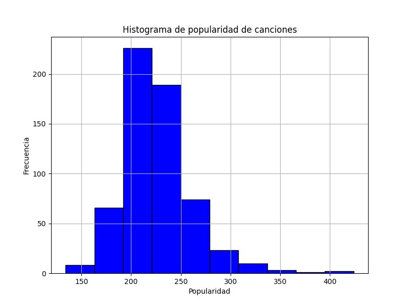

# Repositorio para el Curso UCA #

Este repositorio contiene el análisis de datos para el ejercicio final del curso de Ciencia Abierta de la UCA. Para ello
se utiliza en el dataset "top10s.xlsx", que incluye información sobre canciones populares como título, artista, género, 
año, BPM, energía, duración, popularidad, entre otros.

La estructura del repositorio es como sigue:

    Ejemplo_curso_uca.py: Script principal que carga los datos y nos ofrece tres opciones: 1) generar estadísticas y crear un histograma sobre la popularidad de las canciones, 2) representar la tabla con los datos por pantalla y 3) realizar las dos cosas.
    datos/: Datasets.
        top10s.xlsxcsv: Archivo XLSX con los datos de canciones top 10s.
    hist_popularidad.png: Histograma de la popularidad de las canciones.
    README.md: Este archivo.

Análisis realizado en Python

Se utilizó Python con Pandas y Matplotlib para analizar el dataset.

## Histograma de popularidad de las canciones ##

El siguiente histograma muestra la distribución de la popularidad de las canciones en segundos. La mayoría de las canciones duran entre 200 y 300 segundos.

DOI de Zenodo: